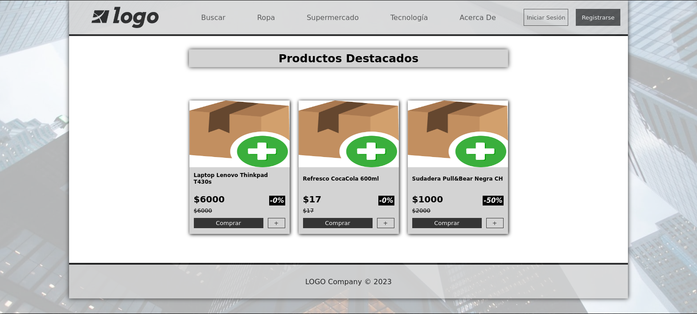
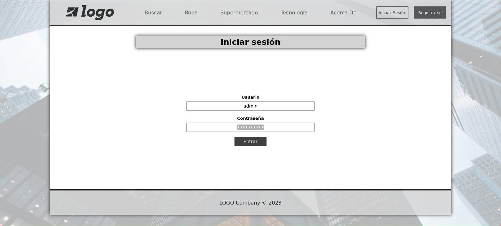
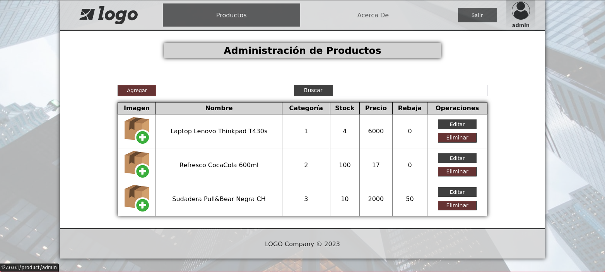
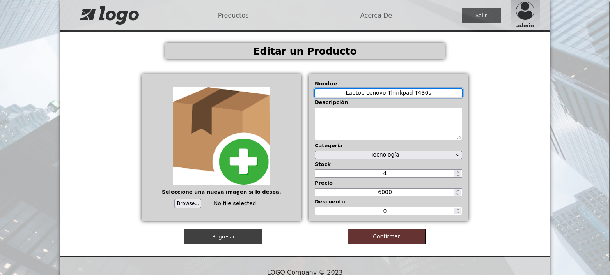
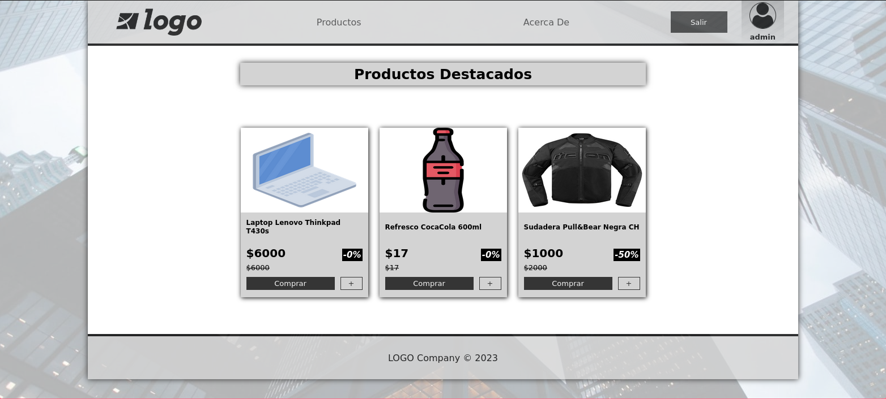

# tiendaonline

Prototipo de una tienda online con PHP y MySQL.

**NOTA**: en este proyecto intento entender el funcionamiento de MVC, por lo que trato de implementar mi propio framework.

**NOTA**: esta app no está terminada.

## Capturas

Página principal

Inicio de Sesión

CRUD de Productos

Editar Productos

Página principal con Productos Modificados

